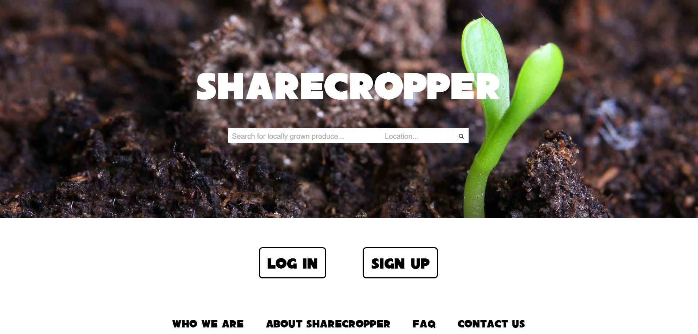
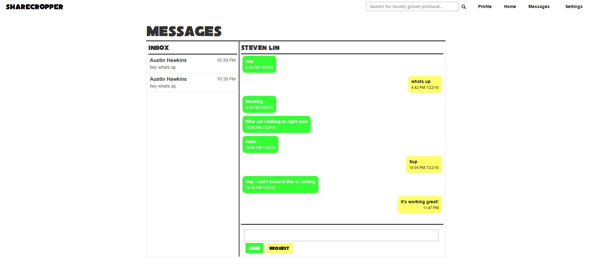

# ShareCropper
P2P platform allowing gardeners to sell crops to neighbors.

Technical overview: This application is written using Express and Handlebars, with React and sockets.io used for the messaging functionality. Client code can be found in the folder `views/`. MongoDB schema is in the `models/` folder. 
